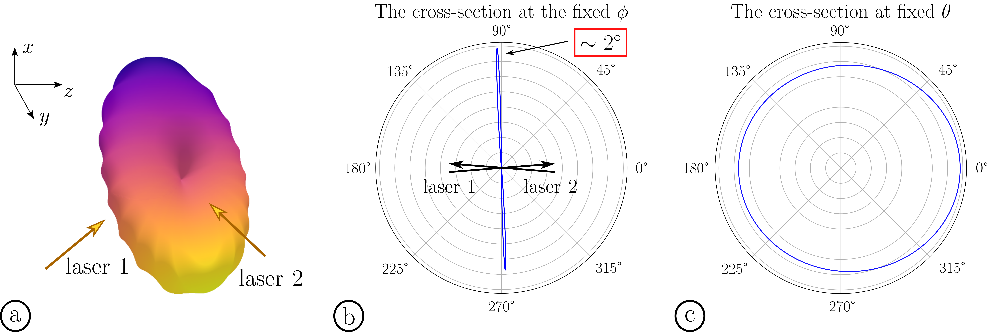

# Angular distribution and power of $2 \omega_p$ electromagnetic emission produced by nonlinear interaction of laser wakefields

Calculation of parameters of electromagnetic radiation (angular distribution and total power) in a wave zone of the source presented by colliding in plasma counter-propagating laser pulses. The problem statement: 
- [**Generation of high-field narrowband terahertz radiation by counterpropagating plasma wakefields**](https://doi.org/10.1063/1.4993100)
- [**Electromagnetic emission due to nonlinear interaction of laser wakefields colliding in plasma at an oblique angle**](https://doi.org/10.1088/1361-6587/abdcdb)

To calculate the angular distribution, one needs to deal with 6-fold integration of a fast oscillating functions. An algorithm for computing n-dimensional integral of a complex function has been developed. The author of the algorithm is [Vladimir Annenkov](https://orcid.org/0000-0002-5577-8595), the implementation of the integrator for *CUDA* is by [Evgeniia Volchok](https://orcid.org/0000-0002-8520-3207) and [Vladimir Annenkov](https://orcid.org/0000-0002-5577-8595).

The essence of the method is to unwrap n-fold summation into 1-fold summation by all possible combinations of variables

$$ \int_{q1} \int_{q2} \int_{q3} ... \int_{qn} f(q1, q2, q3, ..., qn) d q1 d q2 d q3 ... d qn \approx \sum_{q1} \sum_{q2} \sum_{q3} ... \sum_{qn} f(q1, q2, q3, ..., qn) \Delta q1 \Delta q2 \Delta q3 ... \Delta qn  = \qquad\qquad \sum_{q1, q2, q3, ..., qn} f(q1, q2, q3, ... qn) \Delta q1 \Delta q2 \Delta q3 ... \Delta qn$$

and then compute it in parallel processes.

**Figure.** Angular distribution of radiation intensity at $\alpha=5^{\circ}$: a schematic 3D distribution (a); distribution over the polar angle in $(x, z)$-coordinates (b); distribution over the azimuthal angle in the frame co-directed to laser 1 axis (c).

Folder `Scripts` contains a python script to visualize the distribution interactively using `plotly`-module.
